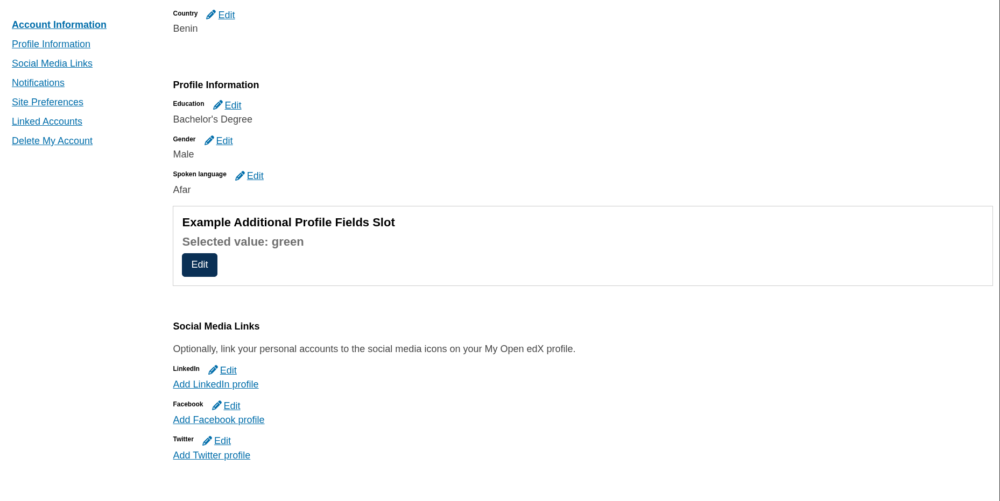

# Extended Profile Fields

### Slot ID: `org.openedx.frontend.account.additional_profile_fields.v1`

## Description

This slot is used to replace/modify/hide the additional profile fields in the account page.

## Example
The following `env.config.jsx` will extend the default fields with a additional custom fields through a simple example component.



### Using the Example Component
Create a file named `env.config.jsx` at the MFE root with this:

```jsx
import { PLUGIN_OPERATIONS, DIRECT_PLUGIN } from '@openedx/frontend-plugin-framework';
import Example from './src/plugin-slots/AdditionalProfileFieldsSlot/example';

const config = {
  pluginSlots: {
    'org.openedx.frontend.account.additional_profile_fields.v1': {
      plugins: [
        {
          op: PLUGIN_OPERATIONS.Insert,
          widget: {
            id: 'extended_account_fields',
            type: DIRECT_PLUGIN,
            RenderWidget: Example,
          },
        },
      ],
    },
  },
};

export default config;
```

## Plugin Props

When implementing a plugin for this slot, the following props are available:

### `updateUserProfile`
- **Type**: Function  
- **Description**: A function for updating the user's profile with new field values. This handles the API call to persist changes to the backend.
- **Usage**: Pass an object containing the field updates to be saved to the user's profile preserving the required structure. The function automatically handles the persistence and UI updates.

#### Example
``` javascript
updateUserProfile({ extendedProfile: [{ fieldName: 'favorite_color', fieldValue: value }] });
```

### `profileFieldValues`
- **Type**: Array of Objects
- **Description**: Contains the current values of all additional profile fields as an array of objects. Each object has a `fieldName` property (string) and a `fieldValue` property (which can be string, boolean, number, or other data types depending on the field type).
- **Usage**: Access specific field values by finding the object with the matching `fieldName` and reading its `fieldValue` property. Use array methods like `find()` to locate specific fields.

#### Example
```json
[
    {
        "fieldName": "favorite_color",
        "fieldValue": "red"
    },
    {
        "fieldName": "data_authorization",
        "fieldValue": true
    },
]
```

### `profileFieldErrors`
- **Type**: Object
- **Description**: Contains validation errors for profile fields. Each key corresponds to a field name, and the value is the error message.
- **Usage**: Check for field-specific errors to display validation feedback to users.

### `formComponents`
- **Type**: Object
- **Description**: Provides access to reusable form components that are consistent with the rest of the account page styling and behavior. These components follow the platform's design system and include proper validation and accessibility features.
- **Usage**: Use these components in your custom fields implementation to maintain UI consistency. Available components include `SwitchContent` for managing different UI states.

### `refreshUserProfile`
- **Type**: Function
- **Description**: A function that triggers a refresh of the user's profile data. This can be used after updating profile fields to ensure the UI reflects the latest data from the server.
- **Usage**: Call this function when you need to manually reload the user profile information. Note that `updateUserProfile` typically handles data refresh automatically.
